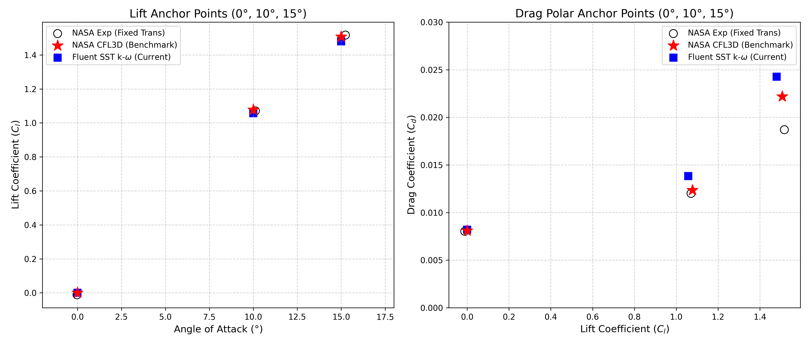
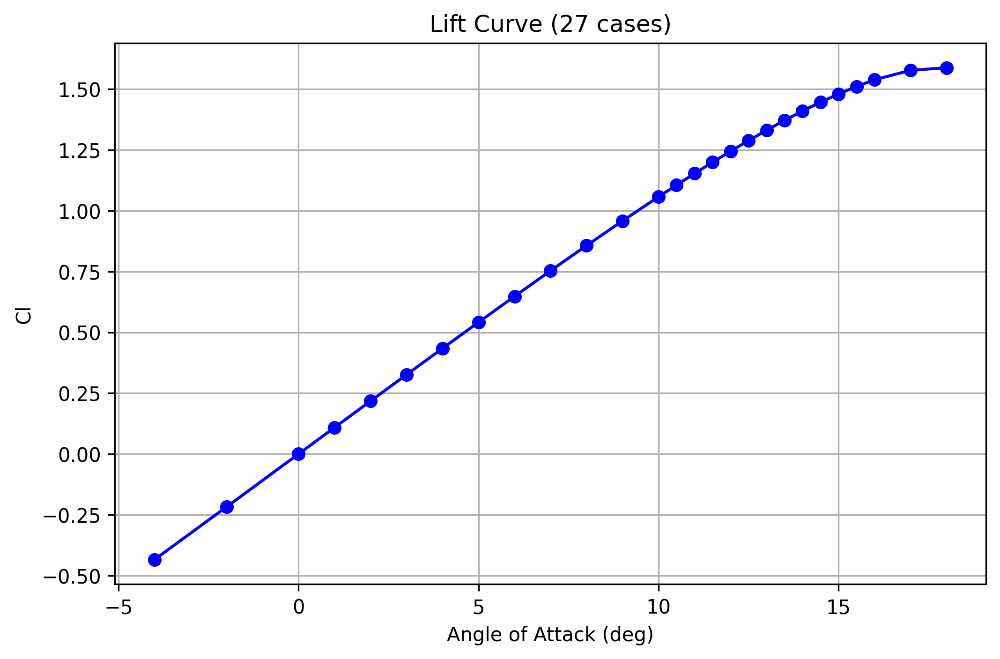
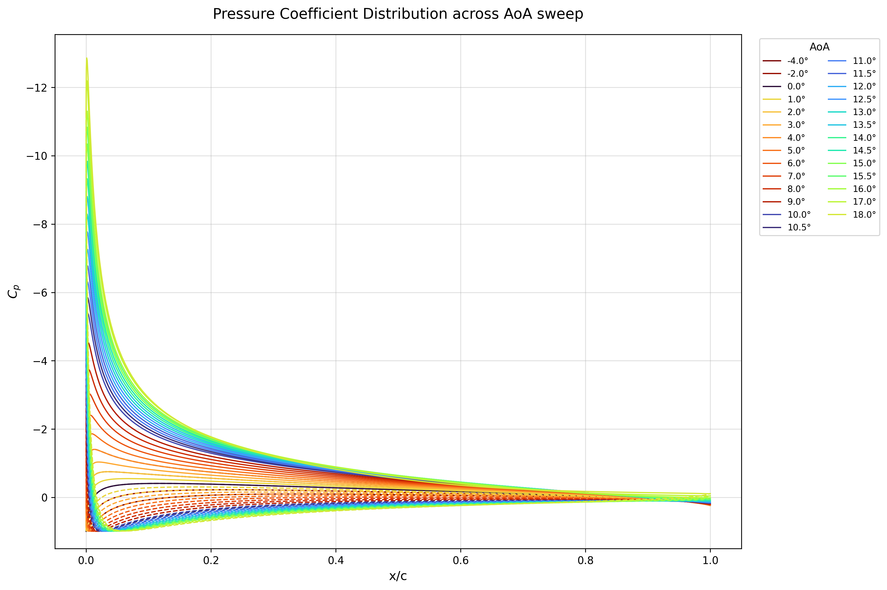

# Physics-Informed ML Surrogate for NACA 0012 Aerodynamics

## 1. Problem Statement
Computational Fluid Dynamics (CFD) provides high-fidelity aerodynamic data, but it is notoriously computationally expensive. A standard 2D airfoil simulation can take upwards of 10 to 15 minutes to converge, making rapid design iteration, aerodynamic optimization, and real-time control system design computationally prohibitive. 

The objective of this project is not to eliminate CFD, but to augment it. By developing a Physics-Informed Machine Learning architecture, we effectively create a **continuous, high-dimensional surrogate model**. Once trained on a foundation of high-fidelity Navier-Stokes data, this surrogate bypasses iterative solvers to predict macroscopic aerodynamic forces (Lift and Drag) and microscopic spatial flow fields (Surface Pressure Coefficient, $C_p$) in fractions of a second, based purely on the Angle of Attack (AoA).
---
## 2. Mesh Strategy and Verification
A rigorous grid-independence and boundary layer resolution study was conducted prior to dataset generation to ensure the neural network was trained on physically accurate ground truth data.

* **Mesh Type:** A fully structured, face-mapped Quad4 C-Grid topology. This ensures perfect alignment with the streamwise flow, minimizing numerical diffusion.
* **Boundary Layer (BL) Settings:** The first cell height was mathematically locked via bias factor adjustments to enforce a non-dimensional wall distance of **$y^+ < 1.0$**. Validation at the most extreme flow condition ($\alpha = 18^\circ$) confirmed a maximum $y^+$ of $\approx 0.45$ and an average $y^+$ of $< 0.15$.
* **Why this choice:** 1. Resolving the viscous sublayer ($y^+ \le 1.0$) is a strict mathematical requirement for the $k-\omega$ SST model to accurately predict adverse pressure gradients and flow separation without relying on wall functions.
  2. Roache's Grid Convergence Index (GCI) method was applied across Coarse (97k), Medium (192.5k), and Fine (390k) grids. The **Medium Mesh (192,500 cells)** was selected because it achieved a GCI of just 0.85% for drag, providing grid-independent accuracy while saving 50% in computational overhead compared to the fine mesh.
* **Read the full report:** [Mesh Convergence & Independence Study](reports/Mesh_Convergence_&_Independence_Study.md)
--- 
## 3. Dataset Generation (CFD Automation)
To train an effective surrogate, a robust, programmatic data-generation pipeline was engineered using Python to drive ANSYS Fluent in batch mode via TUI journal files.

* **CFD Solver:** ANSYS Fluent 2D (Pressure-Based Coupled Solver).
* **Turbulence Model:** $k-\omega$ SST (selected for its superior performance in predicting adverse pressure gradients and flow separation).
* **Flight Conditions:** Reynolds Number = $6 \times 10^6$, Freestream Velocity = 87.64 m/s.
* **Execution Strategy (Serial vs. Parallel):** Parallel processing was intentionally disabled for the final sweep. It was discovered that Fluent's automatic mesh partitioning across cores was inducing artificial reverse flow and negative turbulence kinetic energy ($k$) values at some Angles of Attack. Running the batches strictly in serial mode eliminated these partition boundary artifacts and stabilized the solver across the entire aerodynamic regime.
* **Physical Convergence Criteria:** Default equation residuals often artificially stall or provide a false sense of convergence. Therefore, default residual checks were completely disabled in the journal script. Instead, a strict physical convergence monitor was implemented: the solver evaluates the flow as converged *only* when the Lift Coefficient ($C_l$) variation drops below `1e-5` for 20 consecutive iterations.
* **The Sweep Strategy:** A parameterized run matrix of distinct AoA cases was generated. To maintain mesh quality and fully automate the pipeline, the geometry remained static. Flow rotation was achieved mathematically: velocity vectors ($V_x$, $V_y$) were dynamically calculated in the Python wrapper and injected directly into the Fluent inlet boundary conditions using journal file.
* **Capturing Stall:** To ensure the neural network learns the complex, non-linear physics of boundary layer separation, the sweep resolution was strategically tightened to 0.5° intervals within the critical stall regime.

---
## 4. Numerical Verification & Experimental Validation
Before committing to the computationally expensive generation of the machine learning dataset, a rigorous verification study was conducted. The goal was to prove that the selected 10-chord radius C-Grid and solver settings produced mathematically sound and physically accurate ground truth data.

To do this, a **3-Way Aerodynamic Comparison** was performed at three critical anchor points: $\alpha = 0^\circ$ (Symmetry), $\alpha = 10^\circ$ (High-Linear), and $\alpha = 15^\circ$ (Near-Stall).



1. **Experimental Validation (NASA Ladson - 80 Grit):** The CFD results were compared against NASA wind-tunnel data. The "80 grit" fixed-transition dataset was explicitly chosen because it forces a fully turbulent boundary layer, creating an "apples-to-apples" comparison with Fluent's fully turbulent SST $k-\omega$ model. 
2. **Numerical Verification (NASA CFL3D):** The results were benchmarked against NASA's Turbulence Modeling Resource (TMR) CFL3D solver, which utilized a massive 897x257 grid with zero mathematical blockage. 
3. **Current Setup (ANSYS Fluent):** The high-fidelity CFD predictions generated by our automated 10-chord radius C-Grid batch pipeline, representing the core training dataset of this project.

**Conclusion:**
The Fluent setup (blue squares) perfectly intersects the NASA CFL3D benchmark (red stars) on the lift curve, unequivocally verifying the numerical accuracy of the mesh and solver. The slight under-prediction in the drag polar compared to the Ladson experimental data (black circles) is expected and physically consistent; it represents the difference between a perfect 2D numerical profile and the parasitic drag penalty introduced by the physical sand grit used to trip the boundary layer in the actual wind tunnel.

---
## 5. Data Extraction and Standardization (ETL)
Neural networks require perfectly uniform input tensors. However, native CFD exports are inherently unstructured; the surface coordinate distribution varies depending on the specific mesh deformation, boundary layer inflation, or local flow solution. 

To prepare the dataset(`airfoil_dataset.npz`) for deep learning, a fully automated ETL (Extract, Transform, Load) Python pipeline was implemented to process the 27 converged Fluent cases.

1. **Global Force Extraction ($C_l$, $C_d$):** Convergence history logs were parsed programmatically. To ensure the final force readings were truly stable, the pipeline averages the final 20 iterations of the converged run.
2. **Spatial Standardization ($C_p$):** Raw Upper and Lower surface pressure coefficient exports were extracted. Because the raw data points are unevenly distributed, the pipeline maps them onto a perfectly uniform 150-point geometric cosine-spaced grid ($x_{grid} = 0.5 \times (1 - \cos(\beta))$) using 1D linear interpolation. This cosine clustering ensures high data resolution is preserved at the critical leading and trailing edges.
3. **Target Vector Packaging:** The pipeline yields a standardized, machine-learning-ready feature matrix where a single input vector `[AoA, Reynolds Number]` maps strictly to a 300-point $C_p$ distribution (150 upper, 150 lower) and two global aerodynamic scalar forces ($C_l$, $C_d$).

### Dataset Visual Validation
The resulting dataset successfully captured the non-linear aerodynamics across the entire sweep, including the rapid growth of the leading-edge suction peak and the onset of stall.

*(Left: Extracted Lift Curve. Right: Standardized 300-point $C_p$ distributions across the AoA sweep).*

<div align="center">
  
  
</div>

---
## 6. Machine Learning Architecture
The core challenge in replacing a CFD solver is mapping a scalar input (Angle of Attack) to a high-dimensional spatial output (a 300-point $C_p$ curve). 

To solve this, a hybrid **1D Convolutional Neural Network (CNN)** was developed. The scalar input is projected into a high-dimensional latent space via Dense layers, reshaped into a spatial grid, and smoothed using Conv1D layers.

### The Problem: Interpolation vs. Extrapolation
A standard neural network was trained and subjected to two distinct data-split regimes to test its physical robustness. While a ROM operates best inside its design envelope, real-world aerodynamics (e.g., gusts, hard maneuvers) will inevitably push the model into Out-of-Distribution (OOD) edge cases. 

1. **The Interpolation Test (Random Split):** The CNN was trained on a random shuffle of all aerodynamic regimes. It achieved near-perfect accuracy (RMSE $\approx 0.017$), proving that inside the envelope, AI can easily connect the dots between known data points.
2. **The Extrapolation Stress Test (Structured Split):** To prove the model actually learned fluid dynamics—and wouldn't fail catastrophically during an OOD event—the dataset was split strictly by regime. The CNN was trained *only* on the linear regime ($\alpha \le 8^\circ$), validated on unseen transition regime ($8^\circ < \alpha \le 12^\circ$), and asked to predict the unseen post-stall regime ($\alpha > 12^\circ$). 

**The Baseline Failure:** Under the extrapolation stress test, the standard CNN failed catastrophically (RMSE $\approx 1.97$). Because it is purely data-driven, it lacked the physical intuition to predict boundary layer separation, instead blindly extending the linear lift trend into unphysical pressure distributions. 

*Conclusion: Standard deep learning cannot safely act as an aerodynamic ROM because it halluncinates during edge cases. The network must be constrained by physics.*
2. **The Extrapolation Stress Test (Structured Split):** To test if the model actually learned fluid dynamics, the dataset was split strictly by regime. The CNN was trained on the linear regime ($\alpha \le 8^\circ$), validated on the transition regime ($8^\circ < \alpha \le 12^\circ$), and tested on the pre-stall regime ($\alpha > 12^\circ$).

**The Baseline Failure:** Under extrapolation, the standard CNN failed catastrophically (RMSE $\approx 1.97$). Because it is purely data-driven, it lacked the physical intuition to predict boundary layer separation, instead blindly extending the linear lift trend into unphysical pressure distributions. 

*Conclusion: Standard deep learning cannot reliably replace CFD for unseen boundary conditions. The network must be constrained by physics.*

### Quantifying the Failure (Epistemic Uncertainty)
To rigorously prove that the standard neural network was guessing rather than learning physics, a **Deep Ensemble** (3 parallel networks with different weight initializations) was trained on the exact same structured split. 

By measuring the variance (Standard Deviation) between the ensemble members' predictions, we can quantify the model's *Epistemic Uncertainty* (its lack of knowledge).

**Deep Ensemble Extrapolation Results ($\alpha > 12^\circ$):**
* **Increasing Doubt:** At the edge of the training data ($\alpha = 12.5^\circ$), the ensemble uncertainty was $\pm 0.038$. Deep into the unseen stall regime ($\alpha = 18^\circ$), the uncertainty completely doubled to $\pm 0.076$. The model literally mathematically admitted it did not know what it was doing.
* **The Drag Catastrophe:** While the model managed a 2.39% average error in extrapolating the relatively linear Lift coefficient ($C_l$), it completely failed to predict Drag ($C_d$), resulting in a massive **24.83% average error**. Standard ML architectures fundamentally fail to extrapolate exponential aerodynamic penalties.

*Next Step: Constraining the network with Navier-Stokes derivatives and Momentum Integration loss.*

### Constraining the AI: The PINN Prototype
To stop the network from hallucinating physically impossible pressure curves, the architecture was upgraded into a **Physics-Informed Neural Network (PINN)**. 

Instead of relying purely on data loss, a custom training loop was engineered in TensorFlow to enforce physical laws directly inside the gradient descent. The network takes the predicted pressure curves and numerically integrates them (using the Trapezoidal rule) across the chord length to compute the predicted Normal Force ($C_n$). It then projects this into the macroscopic Lift Coefficient ($C_L$):

$$C_L = \left( \int_0^1 (C_{p, lower} - C_{p, upper}) \, dx \right) \cos(\alpha)$$

A physical penalty term was added to the loss function, forcing the model to minimize the difference between the integrated surface pressures and the true CFD Lift force:

$$Loss_{total} = MSE(C_{p_{true}}, C_{p_{pred}}) + \lambda \times MSE(C_{L_{true}}, C_{L_{pred}})$$

**Prototype Results:** While the TensorFlow graph successfully computed the calculus and backpropagated the physical error, deploying this loss on a standard MLP architecture revealed a structural limitation. The MLP lacked the spatial awareness (receptive field) to draw smooth aerodynamic curves. It attempted to satisfy the integral constraint by shifting the entire curve erratically, proving that the PINN requires a spatially aware Convolutional backbone.

### The "Integration Drift" Discovery
Before finalizing the PINN architecture, a baseline test was run to evaluate **Integration Drift**. 
A standard Multi-Layer Perceptron (MLP) was trained to directly predict the global scalar forces $\alpha \rightarrow [C_l, C_d]$. This Direct MLP was then benchmarked against the Lift force mathematically integrated from the spatial 1D-CNN's pressure predictions.

**The Results (Extrapolation $> 12^\circ$):**
* **Direct MLP Lift RMSE:** 0.110
* **Integrated 1D-CNN Lift RMSE:** 0.051

The 1D-CNN, despite never being explicitly trained on Lift, predicted the global Lift force **53% more accurately** than the model explicitly trained to do so. This proved a fundamental aerodynamic reality: giving a neural network high-resolution spatial awareness of the boundary layer ($C_p$) inherently makes it more robust at predicting global momentum ($C_l$) than simple scalar regression.

*(Left: The Direct MLP fails to predict aerodynamic stall, extending a linear trend infinitely. Right: Drag prediction fails to capture exponential separation penalties).*


### Physics-Informed 1D-CNN (PINN-CNN)
To solve the extrapolation failure, the spatial awareness of the 1D-CNN was merged with the mathematical constraints of the PINN prototype. 

A custom `tf.GradientTape` training loop was engineered. In every training step, the 1D-CNN predicts the spatial pressure curve. Before calculating the loss, the TensorFlow graph numerically integrates the predicted Upper and Lower $C_p$ curves over the exact non-uniform cosine grid using the Trapezoidal rule, calculating the resulting Lift Coefficient ($C_L$). 

To prevent the physics constraint from destroying the spatial gradients early in training, an **Adaptive Physics Loss (Lambda Ramping)** was implemented. The network is allowed to learn basic spatial features freely for 50 epochs ($\lambda = 0$), after which the physical constraint is linearly ramped up ($\lambda \rightarrow 1.5$), forcing the predicted curves to enclose the correct total momentum.

**Extrapolation Results ($\alpha > 12^\circ$):**
By forcing the model to respect the macroscopic momentum integral, the PINN-CNN successfully reigned in the massive divergence seen in the baseline models.
* **Baseline CNN $C_p$ Extrapolation RMSE:** ~1.97
* **PINN-CNN $C_p$ Extrapolation RMSE:** 0.72 
* **PINN-CNN $C_L$ Extrapolation RMSE:** 0.046

The PINN-CNN successfully learned to predict the complex boundary layer physics of an airfoil entering aerodynamic stall regime it was never explicitly trained on—while executing the inference in a **few seconds**.

*(Left: Training convergence showing the adaptive Lambda ramping engaging the Physics Penalty. Right: The PINN-CNN successfully capturing the massive suction peak in the unseen post-stall regime).*
<div align="center">
  
  
</div>

---
## 7. Performance: Speed vs. Accuracy Tradeoff
The PINN-CNN architecture successfully decoupled aerodynamic fidelity from computational cost, producing a surrogate ready for real-time deployment.

| Metric                        | ANSYS CFD (Ground Truth) | PINN-CNN Surrogate
| :---                          | :---                     | :---
| **Compute Time / Case**       | ~795 seconds             | < 0.05 seconds (Core Inference)
| **Computational Speedup**     | Baseline                 | **> 15,800x Faster**
| **Global Lift Error ($C_l$)** | Baseline                 | < 3.0% (Unseen Post-Stall Extrapolation)
| **Global Drag Error ($C_d$)** | Baseline                 | RMSE $\approx$ 0.011 (Fails to capture post-stall penalties)

*Note: While the 15,800x speedup represnts raw mathematical inference, the end-to-end Command Line Interface(CLI) script delivers a >2,400x speedup over the RANS solver. The surrogate provides near-perfect accuracy in the linear regime, with error bounding strictly under 3% even when predicting deep boundary layer separation ($>12^\circ$ AoA) that it was never trained on.*

---
## 8. How to Reproduce Results
The repository is structured to allow immediate inference testing without requiring an ANSYS license or heavy compute resources.

1. **Create and activate the Conda environment:**
```bash
 conda env create -f environment.yml
 conda activate cfdml
```
2. **Run the Airfoil Inference Demo for any Angle of Attack (e.g., 16.5 degrees):**
```bash
 python predict_airfoil_demo.py --aoa 16.5
```
3. **Outputs:** The script will automatically load the `.keras` models, perform the prediction in few seconds, and export a high-resolution $C_p$ plot and a statistical summary to the `reports/demo_outputs/` directory.